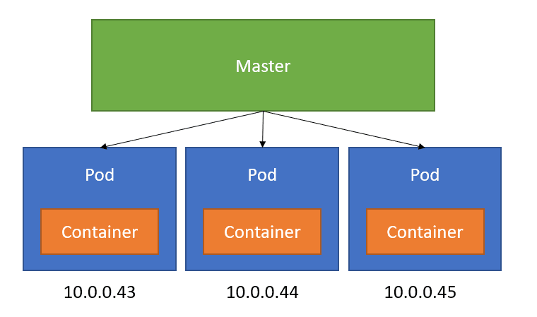

# Pods in Kubernetes

Pods are the fundamental building blocks of Kubernetes. They encapsulate one or more containers, networking, and storage resources. This section covers what a pod is, how it differs from a container, and why pods are a crucial concept in Kubernetes.

## What is a Pod?

A pod is the smallest deployable unit in Kubernetes. It is a group of one or more containers that share the same network namespace, and they can also share storage.

## Pod vs. Container

While containers are the runtime environments for applications, a pod is a Kubernetes abstraction that can encapsulate multiple containers. Pods provide a higher level of abstraction that allows Kubernetes to manage containers more effectively.

- **Container:** A lightweight, standalone executable package that includes everything needed to run a piece of software.
- **Pod:** A higher-level Kubernetes abstraction that can run one or more containers together.

For a deeper dive into what pods are and how they work, check out the [Pod Overview](pod-overview.md) document.

