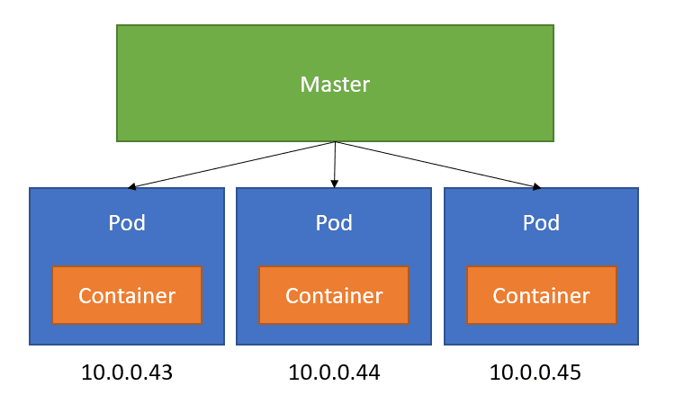

# Pod Overview

In Kubernetes, a **Pod** is the smallest and simplest unit that you can create or deploy. A pod represents a single instance of a running process in your cluster.

## Key Characteristics of a Pod:
- **One or More Containers:** A pod can run a single container or multiple containers that share the same resources and network.
- **Shared Storage and Network:** Containers in a pod share the same network namespace and can communicate with each other via localhost. They can also share storage volumes.

## Why Pods?
- **Tightly Coupled Applications:** Pods are ideal for running tightly coupled application containers that need to share resources.
- **Resiliency:** Pods can be easily replicated, scaled, and managed using Kubernetes controllers like Deployments and StatefulSets.

## Can You Add the Same Container in a Single Pod?

While Kubernetes allows you to run multiple containers within a pod, it is uncommon to run multiple instances of the exact same container within a single pod. Instead, if you need to scale your application or run multiple instances of the same container, you would typically use Kubernetes **Deployments** to manage replicas of pods, each containing one instance of your container.

### Why Avoid Multiple Instances of the Same Container in One Pod?
- **Purpose of Pods:** Pods are designed to run tightly coupled containers that share resources, not to serve as a mechanism for container replication. Running the same container multiple times in a pod would duplicate effort and could lead to resource contention.
- **Best Practice:** Use a pod to encapsulate containers that work together (e.g., a web server and a log processor). For scaling out, use a Deployment to manage multiple pods.




This image shows the basic structure of a pod, where one or more containers share the same network and storage resources.


## Example: Simple Pod Definition File (Nginx)

Here’s a simple example of a Kubernetes pod definition YAML file that runs an Nginx container:

```yaml
apiVersion: v1
kind: Pod
metadata:
 name: nginx
 labels:
   name: web-app
   tier: single
spec:
  containers:
  -  name: nginx
     image: nginx
     ports:
     - containerPort: 80
```

```shell
$ kubectl create -f def.yaml
```
`or`
```shell
$ kubectl apply -f def.yaml
```
 Ref
```shell
https://kubernetes.io/docs/reference/generated/kubectl/kubectl-commands
```


